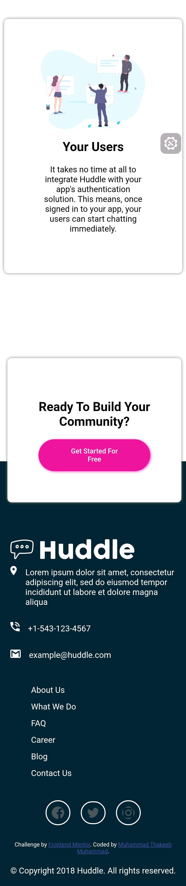

# Frontend Mentor - Huddle landing page with alternating feature blocks solution

This is a solution to the [Huddle landing page with alternating feature blocks challenge on Frontend Mentor](https://www.frontendmentor.io/challenges/huddle-landing-page-with-alternating-feature-blocks-5ca5f5981e82137ec91a5100). Frontend Mentor challenges help you improve your coding skills by building realistic projects. 

## Table of contents

- [Overview](#overview)
  - [The challenge](#the-challenge)
  - [Screenshot](#screenshot)
  - [Links](#links)
- [My process](#my-process)
  - [Built with](#built-with)
  - [What I learned](#what-i-learned)
  - [Continued development](#continued-development)
  - [Useful resources](#useful-resources)
- [Author](#author)

## Overview

### The challenge

Users should be able to:

- View the optimal layout for the site depending on their device's screen size
- See hover states for all interactive elements on the page

### Screenshot
## Desktop View

## Mobile View

### Links

- Solution URL: [Add solution URL here](https://your-solution-url.com)
- Live Site URL: [Add live site URL here](https://your-live-site-url.com)

## My process

### Built with

- Semantic HTML5 markup
- CSS custom properties
- Flexbox
- CSS Grid
- Mobile-first workflow

### What I learned
Some of the things i learnt from this project is using both css grid and flexbox to get the layout of the website more functional. and it was indeed more powerful

### Continued development

I want to continue exploring the mixture of flexbox and css grid to build more responsive web layouts.

### Useful resources

tutorials on linkedin learning. 

Linkedin Courses: https://t.me/Linkedin_Learning

## Author

- Website - [Muhammad Thakeeb Muhammad](https://www.your-site.com)
- Frontend Mentor - [@Thakeeb22](https://www.frontendmentor.io/profile/Thakeeb22)
- Twitter - [@MuhammadThakeeb](https://x.com/MuhammadThakeeb?s=09)

